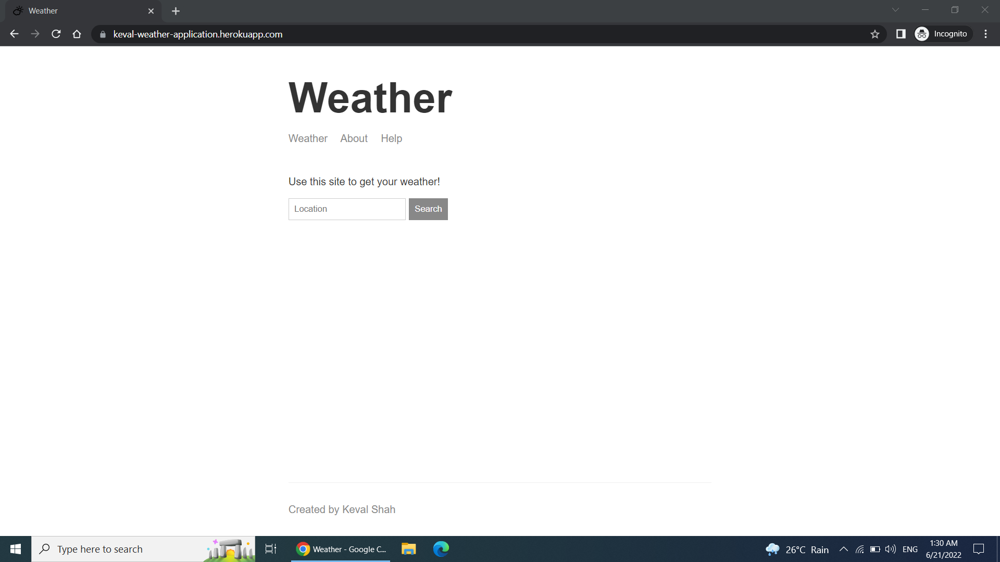
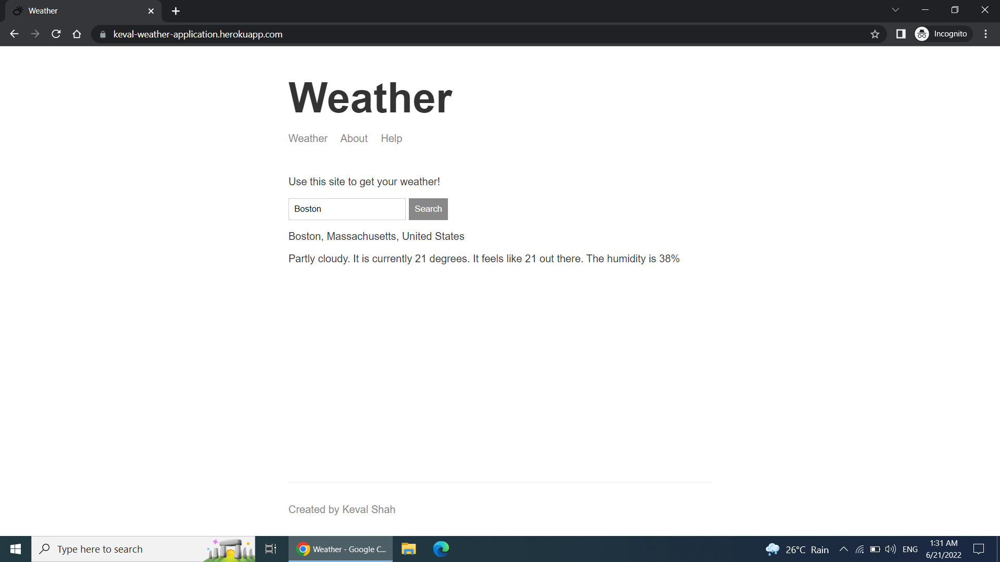
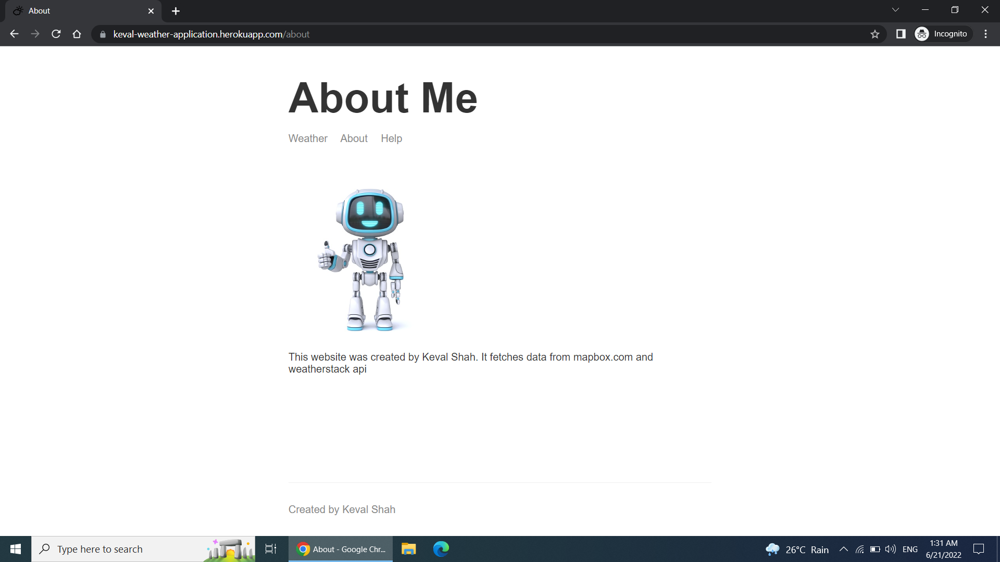
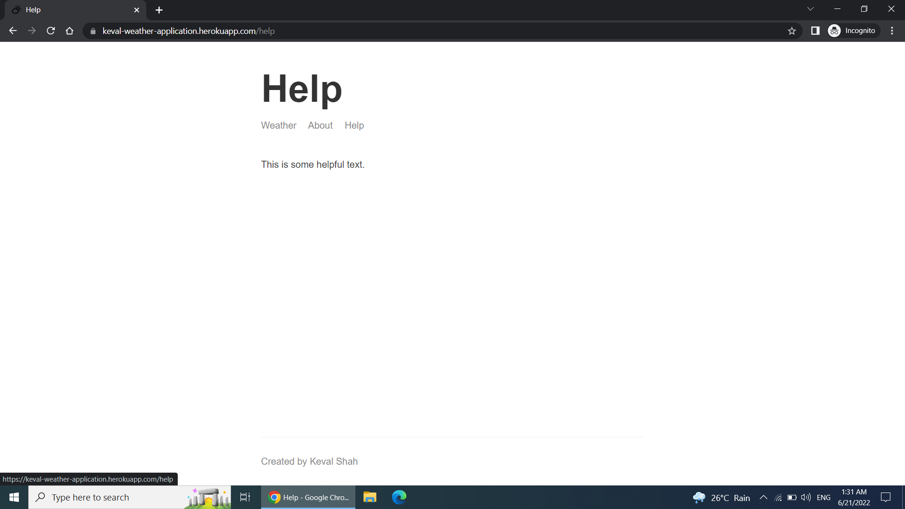

# Weather-App
Application deployed at https://keval-weather-application.herokuapp.com/ 

The application has Frontend(html,css,js) and backend(express,nodejs) technologies used  

Development  Understanding  
A)Initially we build express server,   
1)Gave proper paths to static assests public folder, partials and views, view-engine for handlebars.  
2)Setup Route handlers to listen to events and give render relevant data.  
3)The first page is index.html loaded, when we visit the URL.  

B)Build Index.html  
1)In this page, we initially have form and search field to write the address of the location to fetch.  
2)The corresponding client side javascript is loaded.  
3)Now when user types in location and clicks submit, the client side javascript is invoked and value is fetch from form element, and passed as an argument to fetch call, the fetch call points to /weather URL . 

C)/weather URL  
1)Initially query params are fetched to retrieve the address.  
2)Then we geocode the address using https://api.mapbox.com/.  
3)In geocoding we take address value and callback function, the address is geocoded and corresponding lats and longs are returned.  
4)Then we use Forecast using http://api.weatherstack.com/.  
4)Then with callback chaining, we will call forecast API to give weather forecast of the given lats and longs along with callback function.  
5)Finally we get all the forecast details and corresponding JSON response is send, res.send() will send JSON object with forecast data, location  

D)The fetch call from the browser will now display the message in the browser.  

  
Screenshots
1)Initial browser load

  
2)Writing value, submitting form and displaying value in the browser

  
3)About Page

  
4)help Page
